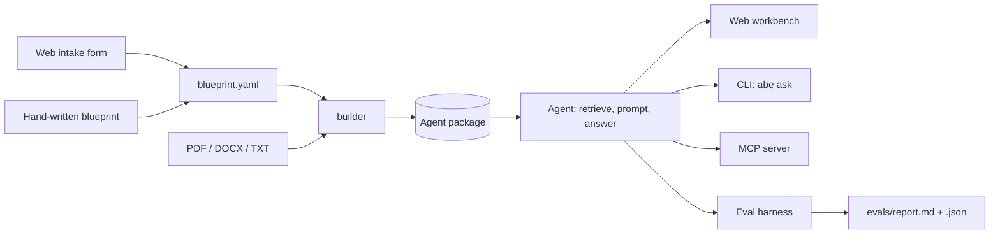

# Architecture

ABE has one data structure at its centre, the agent package, and several ways in and out of it.

## Modules

| Module | Responsibility |
|---|---|
| `spec.py` | `AgentSpec`: name, purpose, rules, provider and retrieval settings. Generates the system prompt. |
| `ingest.py` | Reads PDF, DOCX, TXT and Markdown; splits text into overlapping chunks on paragraph and sentence boundaries. |
| `index.py` | BM25 keyword index, stored as JSON. |
| `providers.py` | Azure OpenAI, OpenAI-compatible (OpenRouter, OpenAI, Ollama, LM Studio, vLLM), Anthropic, and the no-model extractive baseline. Plain HTTPS via `requests`. |
| `agent.py` | Retrieves passages, declines below the score floor, numbers the passages, calls the provider, maps citations back to sources, records token usage. |
| `evals.py` | Runs a YAML test set; scores answers and retrieval separately; writes Markdown and JSON reports; returns a pass/fail for CI. |
| `intake.py` | Six-criterion screen and a build recommendation. |
| `cost.py` | Monthly token volume and cost from usage assumptions and the rates you enter. |
| `builder.py` | Writes the agent package from a blueprint and documents. |
| `mcp_server.py` | Exposes `search_knowledge`, `ask`, `list_sources` and the `agent_rules` prompt to MCP clients; `--retrieval-only` leaves out `ask`. |
| `web.py` | Starlette app: intake form, workbench, evaluation, download. |
| `cli.py` | `serve`, `build`, `reindex`, `ask`, `eval`, `mcp`. |

## Design decisions

**BM25 before embeddings.** Keyword retrieval needs no model, no key and no vector database, so a fresh clone
works offline and CI is deterministic. For short procedural documents it performs well, and the eval harness
reports retrieval hit rate on its own line so you can see when it stops being good enough. The agent depends
only on `index.search(query, k)`; an embedding store that implements the same method can replace it.

**Decline instead of guess.** If the best passage scores below `retrieval.min_score`, the agent says it doesn't
know before any model is called. That saves tokens and removes the commonest source of confident wrong
answers. Tune the floor with the test set: raise it until in-scope questions start declining, then back off.

**A no-model baseline.** The extractive provider quotes the best-matching sentences. It shows what retrieval
alone achieves, so the evaluation answers a question sponsors ask: what is the language model adding, and is
it worth its cost?

**Retrieval and answers scored separately.** When a case fails, the report shows whether the right passage
was retrieved. A miss with a hit is a prompt or model problem; a miss without one is a document or retrieval
problem. They have different fixes.

**No SDKs.** Each provider is one HTTPS request, readable in a few lines and testable with a mocked
`requests.post`. Adding a provider means adding one class.

**Keys stay in the environment.** The spec stores the name of the environment variable, never the key, so an
agent package can be zipped, committed or shared.

## Extending

- **New provider:** subclass `Provider`, implement `complete(system, user) -> Completion`, register it in
  `PROVIDERS`.
- **New file type:** add a branch to `read_document` and the suffix to `SUPPORTED_SUFFIXES`.
- **Embedding retrieval:** implement `search(query, k)` returning `(Chunk, score)` pairs and `sources()`,
  then load it in `Agent.from_directory`.
- **Human-in-the-loop:** `human_review: true` adds a review line to every answer; a fuller approval step
  belongs in the calling application, using the `declined` flag and cited sources the agent returns.
